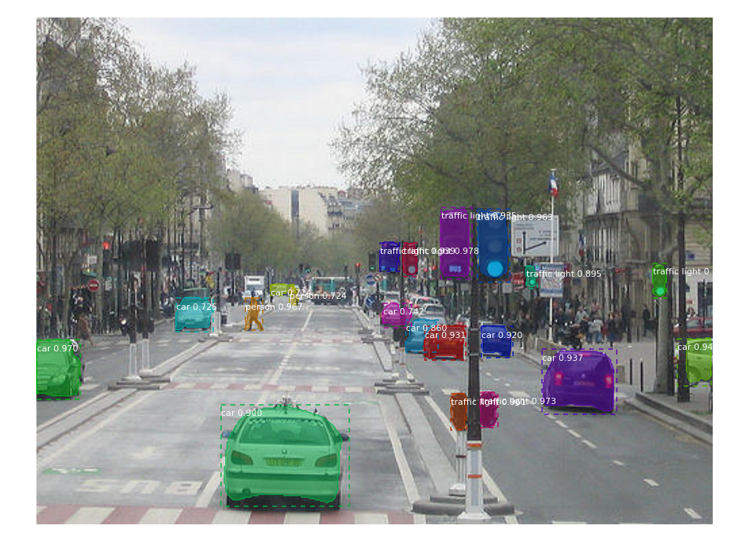

# pytorch-mask-rcnn

This is a Pytorch implementation of [Mask R-CNN](https://arxiv.org/abs/1703.06870) that is in large parts based on Matterport's
[Mask_RCNN](https://github.com/matterport/Mask_RCNN). Matterport's repository is an implementation on Keras and TensorFlow.
The following parts of the README are excerpts from the Matterport README. Details on the requirements, training on MS COCO
and detection results for this repository can be found at the end of the document.

The Mask R-CNN model generates bounding boxes and segmentation masks for each instance of an object in the image. It's based
on Feature Pyramid Network (FPN) and a ResNet101 backbone.

The next four images visualize different stages in the detection pipeline:

##### 1. Anchor sorting and filtering
The Region Proposal Network proposes bounding boxes that are likely to belong to an object. Positive and negative anchors
along with anchor box refinement are visualized.

##### 2. Bounding Box Refinement
This is an example of final detection boxes (dotted lines) and the refinement applied to them (solid lines) in the second stage.

##### 3. Mask Generation
Examples of generated masks. These then get scaled and placed on the image in the right location.

##### 4. Composing the different pieces into a final result

## Requirements
* Python 3
* Pytorch 0.3
* matplotlib, scipy, skimage, h5py

## Installation
1. Clone this repository.

        git clone https://github.com/multimodallearning/pytorch-mask-rcnn.git

    
2. We use functions from two more repositories that need to be build with the right `--arch` option for cuda support.
The two functions are Non-Maximum Suppression from ruotianluo's [pytorch-faster-rcnn](https://github.com/ruotianluo/pytorch-faster-rcnn)
repository and longcw's [RoiAlign](https://github.com/longcw/RoIAlign.pytorch).

    | GPU | arch |
    | --- | --- |
    | TitanX | sm_52 |
    | GTX 960M | sm_50 |
    | GTX 1070 | sm_61 |
    | GTX 1080 (Ti) | sm_61 |

        cd nms/src/cuda/
        nvcc -c -o nms_kernel.cu.o nms_kernel.cu -x cu -Xcompiler -fPIC -arch=[arch]
        cd ../../
        python build.py
        cd ../

        cd roialign/roi_align/src/cuda/
        nvcc -c -o crop_and_resize_kernel.cu.o crop_and_resize_kernel.cu -x cu -Xcompiler -fPIC -arch=[arch]
        cd ../../
        python build.py
        cd ../../

3. As we use the [COCO dataset](http://cocodataset.org/#home) install the [Python COCO API](https://github.com/cocodataset/cocoapi) and
create a symlink.

        ln -s /path/to/coco/cocoapi/PythonAPI/pycocotools/ pycocotools
    
4. Download the pretrained models on COCO and ImageNet from [Google Drive](https://drive.google.com/open?id=1LXUgC2IZUYNEoXr05tdqyKFZY0pZyPDc).

## Demo

To test your installation simply run the demo with

    python demo.py

It works on CPU or GPU and the result should look like this:

## Training on COCO
Training and evaluation code is in coco.py. You can run it from the command
line as such:

    # Train a new model starting from pre-trained COCO weights
    python coco.py train --dataset=/path/to/coco/ --model=coco

    # Train a new model starting from ImageNet weights
    python coco.py train --dataset=/path/to/coco/ --model=imagenet

    # Continue training a model that you had trained earlier
    python coco.py train --dataset=/path/to/coco/ --model=/path/to/weights.h5

    # Continue training the last model you trained. This will find
    # the last trained weights in the model directory.
    python coco.py train --dataset=/path/to/coco/ --model=last

If you have not yet downloaded the COCO dataset you should run the command
with the download option set, e.g.:

    # Train a new model starting from pre-trained COCO weights
    python coco.py train --dataset=/path/to/coco/ --model=coco --download=true

You can also run the COCO evaluation code with:

    # Run COCO evaluation on the last trained model
    python coco.py evaluate --dataset=/path/to/coco/ --model=last

The training schedule, learning rate, and other parameters can be set in coco.py.

## Results

COCO results for bounding box and segmentation are reported based on training
with the default configuration and backbone initialized with pretrained
ImageNet weights. Used metric is AP on IoU=0.50:0.95.

|    | from scratch | converted from keras | Matterport's Mask_RCNN | Mask R-CNN paper |
| --- | --- | --- | --- | --- |
| bbox | t.b.a. | 0.347 | 0.347 | 0.382 |
| segm | t.b.a. | 0.296 | 0.296 | 0.354 |

---------------------------------------------------------------------------------------------------------------
# NSCL TEST
### environment
      # Name                    Version                   Build  Channel
        _libgcc_mutex             0.1                        main  
        binutils_impl_linux-64    2.31.1               h6176602_1  
        blas                      1.0                    openblas  
        ca-certificates           2019.5.15                     1  
        certifi                   2019.6.16                py36_1  
        cffi                      1.12.3           py36h2e261b9_0  
        cloudpickle               1.2.2                      py_0  
        cuda90                    1.0                  h6433d27_0    pytorch
        cudatoolkit               9.0                  h13b8566_0  
        cudnn                     7.6.0                 cuda9.0_0  
        cycler                    0.10.0                   py36_0  
        cython                    0.29.13          py36he6710b0_0  
        cytoolz                   0.10.0           py36h7b6447c_0  
        dask-core                 2.3.0                      py_0  
        dbus                      1.13.6               h746ee38_0  
        decorator                 4.4.0                    py36_1  
        expat                     2.2.6                he6710b0_0  
        fontconfig                2.13.0               h9420a91_0  
        freetype                  2.9.1                h8a8886c_1  
        gcc_impl_linux-64         7.3.0                habb00fd_1  
        glib                      2.56.2               hd408876_0  
        gst-plugins-base          1.14.0               hbbd80ab_1  
        gstreamer                 1.14.0               hb453b48_1  
        icu                       58.2                 h9c2bf20_1  
        imageio                   2.5.0                    py36_0  
        intel-openmp              2019.4                      243  
        jpeg                      9b                   h024ee3a_2  
        kiwisolver                1.1.0            py36he6710b0_0  
        libedit                   3.1.20181209         hc058e9b_0  
        libffi                    3.2.1                hd88cf55_4  
        libgcc-ng                 9.1.0                hdf63c60_0  
        libgfortran-ng            7.3.0                hdf63c60_0  
        libopenblas               0.3.6                h5a2b251_1  
        libpng                    1.6.37               hbc83047_0  
        libstdcxx-ng              9.1.0                hdf63c60_0  
        libtiff                   4.0.10               h2733197_2  
        libuuid                   1.0.3                h1bed415_2  
        libxcb                    1.13                 h1bed415_1  
        libxml2                   2.9.9                hea5a465_1  
        matplotlib                3.1.1            py36h5429711_0  
        mkl                       2018.0.3                      1  
        nccl                      1.3.5                 cuda9.0_0  
        ncurses                   6.1                  he6710b0_1  
        networkx                  2.3                        py_0  
        ninja                     1.9.0            py36hfd86e86_0  
        numpy                     1.16.4           py36h99e49ec_0  
        numpy-base                1.16.4           py36h2f8d375_0  
        olefile                   0.46                     py36_0  
        openssl                   1.1.1d               h7b6447c_1  
        pcre                      8.43                 he6710b0_0  
        pillow                    6.1.0            py36h34e0f95_0  
        pip                       19.2.2                   py36_0  
        pycococreatortools        0.2.0                    pypi_0    pypi
        pycocotools               2.0                      pypi_0    pypi
        pycparser                 2.19                     py36_0  
        pyparsing                 2.4.2                      py_0  
        pyqt                      5.9.2            py36h05f1152_2  
        python                    3.6.9                h265db76_0  
        python-dateutil           2.8.0                    py36_0  
        pytorch                   0.4.1           py36_py35_py27__9.0.176_7.1.2_2    pytorch
        pytz                      2019.2                     py_0  
        pywavelets                1.0.3            py36hdd07704_1  
        qt                        5.9.7                h5867ecd_1  
        readline                  7.0                  h7b6447c_5  
        scikit-image              0.15.0           py36he6710b0_0  
        scipy                     1.2.1            py36he2b7bc3_0  
        setuptools                41.0.1                   py36_0  
        sip                       4.19.8           py36hf484d3e_0  
        six                       1.12.0                   py36_0  
        sqlite                    3.29.0               h7b6447c_0  
        tk                        8.6.8                hbc83047_0  
        toolz                     0.10.0                     py_0  
        tornado                   6.0.3            py36h7b6447c_0  
        wheel                     0.33.4                   py36_0  
        xz                        5.2.4                h14c3975_4  
        zlib                      1.2.11               h7b6447c_3  
        zstd                      1.3.7                h0b5b093_0  
 
 ### Train (Nobrand)
 
        python nobrand_train.py train --dataset=dataset_no
       
 ### Detect (Nobrand)
 
        python nobrand_detect_image.py
